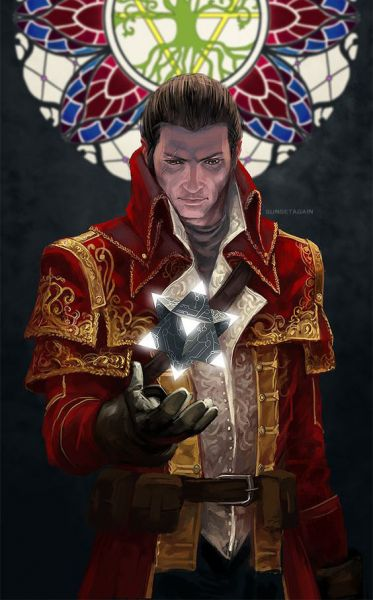

# Merrix d'Cannith

Baron Merrix d'Cannith is the current head of House Cannith South. He is one of the most renowned artificers in Khorvaire today.
Merrix is the grandson of the first Merrix, and son of Aaren d'Cannith. He is also the former patriarch's grandnephew. Prior to the death of Starrin d'Cannith, Merrix spent most of his time in his labs performing various experiments, from that time he is regarded as one of the best alchemists that House Cannith has ever produced. He was an infant when the first warforged were made and is the youngest of the three leaders trying to become the "Great Gorgon." Being the youngest of the three he also has the weakest claim, but his skill makes the other two leaders wary of him. Additionally, some question if he could forsake his experiments and truly be a leader, but he has stepped up to the plate and led those who follow him so far.

## DM Section
Merrix does not want to be the leader for the sake of personal power; he simply feels that the other two are not strong enough to do a good job of it. He's willing to lead for now, but he'd prefer to be left to his experiments. If he could find someone whom he thought was forceful enough to be taken seriously by the other houses and also willing to give Merrix a voice in house decisions, he'd be happy to hand over the routine politics of leadership
