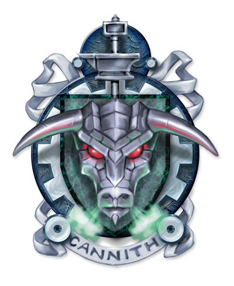

## House Cannith
House Cannith is well known for their innovation and advancements in technology. They are responsible for technological wonders such as the Warforged and the lightning rail. House Cannith provide repair services and the house's gorgon mark is a known and trusted symbol that appears on magical and mundane items. Through past wars Cannith have become the most politically powerful dragonmarked house.

## Dragonmark
House Cannith possesses the Mark of Making. This mark grants various magical benefits that allow its bearers to infuse items with magic or even repair them, giving Cannith an advantage in the manufacturing arena.

## History
2,500 years ago the Mark of Making made its first appearances on the artisans and craftsmen of ancient Cyre. This soon led to the formulation of Clan Cannith and through their natural inventiveness and the ability of their marks they created their own jurisdictions within Cyre and central Khorvaire.

In -500 YK The War of the Mark began and Cannith found itself an active and enthusiastic participant, though involved more heavily in trade and manufacturing than combat. It was during this war that Cannith discovered the Mark of Detection dragonmark and soon after this the Brelish half-elves who possessed it became House Medani. After the war, Cannith had emerged as a super-power among the houses and used that influence to bring the other houses together to form The Twelve. They allied with the elemental binders of Zilargo and the scions of House Lyrander to create the first elemental sea vessels. Charged by their overwhelmingly successful project, the magewrights of House Cannith collaborated with House Orien to create the lightning rail. The project was finished in 811 YK connecting Flamekeep and Fairhaven. Seemingly on a roll with their past successes, House Sivis sought out the help of Cannith to create the message stations.

When the Last War broke out, Cannith was ready to reap the benefits and found itself acting as an arms dealer to all nations. They amassed a great fortune in gold, rivalling that of House Kundarak. They also gained something more valuable than money: political power. The Five Nations became so reliant on Cannith weapons that the availability of their goods began to affect how each nation made policy decisions, giving the Dragonmarked House unprecedented political advantage.

The first Warforged soldiers marched out of Cannith's forgehold at Whitehearth in 965 YK. Simply supplying weapons and armor was not enough for the ambitious Cannith; they would also supply the soldiers to wield them. By the end of the war. House Cannith was believed to be the most powerful Dragonmarked House.

That ended on the Day of Mourning in 994 YK. The disaster that destroyed Cyre also destroyed the Whitehearth forgehold and its wealth, knowledge, and resources and inhabitants. Among the casualties were the Cannith patriarch Baron Starrin d'Cannith and many of the House's heirs.

After the war, matters only got worse for Cannith. The Treaty of Thronehold not only liberated the Warforged, but also banned Cannith from creating any more. With the end of the war came the end of Cannith's role as an international arms dealer and some of their political influence ended with it.

The leaders of House Cannith today have become incredibly determined to restore their power and wealth leading to bitter rivalry amongst the leaders. At any given moment, the inventors of House Cannith are hard at work in secret laboratories, relentlessly working to out-do their past creations and create Eberron's next technological revolution.

## Hierarchy
The ruling leader of House Cannith is called a Patriarch (or Matriarch if female). The last Patriarch was Starrin d'Cannith. Starrin's only heir died along with him on the Day of Mourning, complicating the line of succession. Three heirs stepped up to claim the title: Merrix, Zorlan and Jorlanna. None could claim a majority of supporters, so the House has split into three factions, each supporting one of the heirs: Cannith West, East and South.

## Business
House Cannith produce mundane fine wares that although were crafted using magic, are not magical items. Items that are created by House Cannith are marked with the House's gorgon symbol, a symbol which is known to indicate quality and value. Cannith create all sorts of items such as watertight barrels, horse shoes and sword hilts. Cannith operates very few retail establishments; the Fabricator's Guild prefers to leave the selling to merchants so they can focus on production. Despite this, Cannith still dominates commerce and industry in Khorvaire. Cannith's Tinkers Guild enlists roaming tinkers to provide repair services for broken goods, and Cannith magewrights are needed for the production of various elemental machines.

### Cannith Inventions
Elemental airship
Elemental galleon
Elemental land cart
Everbright lantern
[Lightning rail](../../lightning-rail.md)
The floating towers of Sharn
Warforged

## Notable Locations
Sharn Enclave
* Run by Merrix d'Cannith, this enclave in Sharn's Ashblack district is a large collection of forges and laboratories.
Aundair Enclave
* Located outside of Fairhaven, this villa is home to Jorlanna.
Korth Enclave
* This enclave is a compound that houses both Zorlan and The Twelve.

## Guilds
Fabricators Guild
Tinkers Guild
